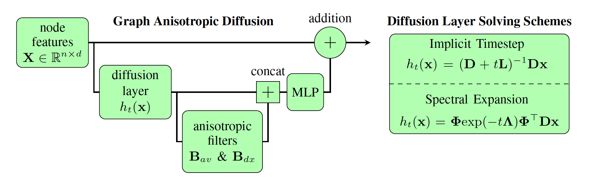

# Graph Anisotropic Diffusion
The implementation of the paper [***Graph Anisotropic Diffusion***](https://arxiv.org/abs/2205.00354) using PyTorch and PyTorch Geometric libraries.


## Description 
This repository is structured in the following manner:
* ***```src```*** contains the scripts to create Graph Anisotropic Diffusion (GAD) model, including diffusion layer, aggregation matrices, GAD_layer, and full GAD architecture.
* ***```experiments```*** contains the scripts to generate our results on molecular property prediction benchmarks.


## Citation 
```
@article{
elhag2022graph,
title={Graph Anisotropic Diffusion},
author={Ahmed A. A. Elhag and Gabriele Corso and Hannes St{\"a}rk and Michael M. Bronstein},
booktitle={arXiv preprint arXiv:2205.00354},
year={2022},
url={https://arxiv.org/abs/2205.00354}
}
```
